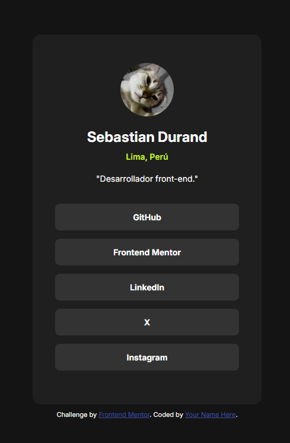

# Frontend Mentor - Social links profile (Solución)

Esta es una solución al desafío de perfil de enlaces sociales en Frontend Mentor (https://www.frontendmentor.io/challenges/social-links-profile-UG32l9m6dQ). Los desafíos de Frontend Mentor te ayudan a mejorar tus habilidades de codificación mediante la creación de proyectos realistas.

## Tabla de contenido

- [Descripción general](#descripción-general)
  - [El desafío](#el-desafío)
  - [Captura de pantalla](#captura-de-pantalla)
  - [Enlaces](#enlaces)
- [Mi proceso](#mi-proceso)
  - [Construido con](#construido-con)
- [Autor](#autor)

## Descripción general

En este desafío apliqué lo aprendido en lecciones anteriores para crear un espacio minimalista que conecta todos mis perfiles profesionales y proyectos, ofreciendo acceso rápido y directo a mi presencia en línea.

### El desafío

Su desafío es desarrollar este perfil de enlaces sociales y lograr que se parezca lo más posible al diseño.

Puedes usar cualquier herramienta que te guste para ayudarte a completar el desafío. Así que, si hay algo que te gustaría practicar, no dudes en intentarlo.

Sus usuarios deberían poder:

- Ver estados de desplazamiento y enfoque para todos los elementos interactivos en la página

### Captura de pantalla

### Enlaces

- URL a la solucion: [GitHub repository](https://github.com/dandfres/social-links-profile-main)
- URL al sitio desplegado: [GitHub Pages](https://dandfres.github.io/social-links-profile-main/)

## Mi proceso

1. Hize un boceto (wireframe) para definir la estructura y dispocicion de los elementos.
2. Se estableció la estructura del html para luego darle estilo con css.
3. Luego subí el proyecto a mi repositorio.
4. Por ultimo edite el README.md.

### Construido con

- Semantic HTML5 markup
- CSS custom properties
- Flexbox

## Autor

- Enlaces a mis redes sociales - [Sebastian Durand](https://dandfres.github.io/social-links-profile-main/)
- Frontend Mentor - [@dandfres](https://www.frontendmentor.io/profile/dandfres)
